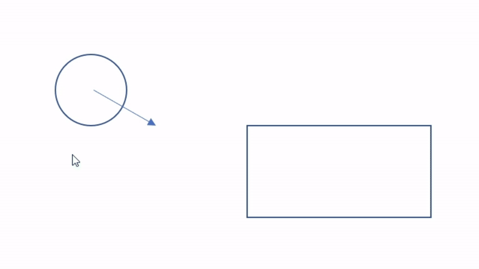

# 🏐 BallWarrior

BallWarrior là một game clone từ **Arkanoid**, được viết bằng **Java + Swing**.  
Người chơi điều khiển thanh trượt để đỡ bóng, phá hết gạch để qua màn.

---

## 🎮 Gameplay

- Di chuyển thanh trượt trái/phải để giữ bóng không rơi.
- Phá hết gạch trên màn hình để chiến thắng.
- Nếu bóng rơi xuống thì thua.

 <!-- thay bằng ảnh thực tế -->

### 🔹 Va chạm bóng – gạch
Minh họa hệ thống Collision:


---

## 📂 Cấu trúc thư mục 
```bash
BallWarrior/
├── src/
│   ├── Main.java                  # Điểm khởi chạy game (tạo JFrame, gắn GameEngine)
│   │
│   ├── core/                      # Lõi engine (tách biệt logic Arkanoid)
│   │   ├── GameEngine.java        # Khởi tạo game, gắn JFrame, chạy GameLoop
│   │   ├── SceneManager.java      # Quản lý chuyển đổi scene (Menu, Game, Pause…)
│   │   ├── InputHandler.java      # Quản lý phím bấm, lưu trạng thái key
│   │   ├── ResourceLoader.java    # Load ảnh, âm thanh, font từ thư mục assets
│   │   └── SoundManager.java      # Quản lý âm thanh (phát nhạc, hiệu ứng sfx)
│   │
│   ├── game/                      # Logic gameplay Arkanoid
│   │   ├── GameScene.java         # Cảnh chơi chính (ball, paddle, brick…)
│   │   ├── LevelManager.java      # Load level từ file (JSON/TXT)
│   │   ├── CollisionSystem.java   # Xử lý va chạm (ball - paddle - brick)
│   │   ├── ScoreSystem.java       # Quản lý điểm số, mạng
│   │   └── PowerUpSystem.java     # Quản lý item rơi ra, hiệu ứng power-up
│   │
│   ├── game/collision/            # Module va chạm (tách riêng, dễ mở rộng)
│   │   ├── CollisionSystem.java   # Điều phối va chạm (tìm nearest collision)
│   │   ├── CollisionResult.java   # Data class (entity, hitPoint…)
│   │   ├── CollisionUtils.java    # Hàm tiện ích (isBetween, getLineIntersection, circleLineIntersection…)
│   │   ├── CircleVsAABB.java      # Ball vs Paddle/Brick (AABB)
│   │   └── CircleVsCircle.java    # Ball vs Ball / PowerUp (nếu cần)
│   │
│   ├── entity/                    # Các đối tượng trong game
│   │   ├── Entity.java            # Lớp cha (position, velocity, draw, update)
│   │   ├── Ball.java              # Quả bóng (di chuyển, nảy, va chạm)
│   │   ├── Paddle.java            # Thanh trượt điều khiển bằng phím
│   │   ├── Brick.java             # Gạch (có màu, độ bền, phá hủy)
│   │   ├── Skins.java             # Định nghĩa skin (tên, độ hiếm, giá, màu/ảnh)
│   │   └── PowerUp.java           # Item tăng sức mạnh (rơi ra từ Brick)
│   │
│   ├── ui/                            # Toàn bộ giao diện người dùng
│   │   ├── base/                      # Các lớp cơ sở / trừu tượng
│   │   │   ├── Scene.java             # Lớp cha cho mọi màn hình (Menu, Shop…)
│   │   │   └── Button.java            # Lớp cha trừu tượng cho các loại nút
│   │   │
│   │   ├── button/                    # Các loại nút kế thừa Button
│   │   │   ├── TextButton.java        # Nút văn bản căn giữa (menu chính)
│   │   │   ├── MenuButton.java        # Nút căn giữa (menu chính)
│   │   │   ├── RectButton.java        # Nút chữ nhật (shop, pause…)
│   │   │   └── IconButton.java        # (tuỳ chọn) nút có biểu tượng hoặc ảnh
│   │   │
│   │   ├── scene/                     # Các màn hình giao diện riêng biệt
│   │   │   ├── MenuScene.java         # Menu chính (Play, Exit…)
│   │   │   ├── ShopScene.java         # Màn hình shop (mua/chọn skin)
│   │   │   ├── PauseScene.java        # Màn hình tạm dừng game
│   │   │   └── GameOverScene.java     # Màn hình kết thúc (thắng / thua)
│   │   │
│   │   └── HUD.java                   # Heads-up display trong gameplay (điểm, mạng…)
│   │
│   └── utils/                     # Tiện ích chung
│       ├── MathUtils.java         # Hàm toán học 2D, giao điểm đoạn thẳng…
│       ├── Constants.java         # Các hằng số (WIDTH, HEIGHT, tốc độ…)
│       └── Vector2D.java          # Class vector 2D (dx, dy, hỗ trợ toán học)
│
├── assets/                        # Tài nguyên (cùng bậc với src)
│   ├── images/                    # Hình ảnh
│   │   ├── ball.png
│   │   ├── paddle.png
│   │   └── brick_red.png
│   ├── sounds/                    # Âm thanh
│   │   ├── bounce.wav
│   │   ├── break.wav
│   │   └── powerup.wav
│   └── levels/                    # Map / màn chơi
│       ├── level1.txt
│       ├── level2.txt
│       └── level3.txt
│
└── README.md                      # Tài liệu mô tả project

```
---

## 🚀 Cách chạy

Yêu cầu:
- **Java 17+** (hoặc tương thích).

Chạy bằng dòng lệnh:

```bash
# Biên dịch
javac Main.java

# Chạy game
java Main
Hoặc mở trực tiếp trong IntelliJ IDEA / Eclipse / NetBeans và chạy Main.
```
🛠️ Công nghệ sử dụng

Java 17

Swing (UI & rendering)

OOP design

🤝 Đóng góp

Pull requests được hoan nghênh.
Nếu phát hiện bug, vui lòng tạo issue trong repo.